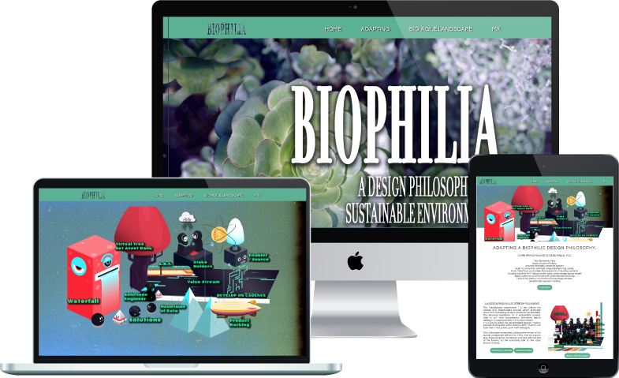

 *A design shop inspired by nature's wisdom on sustainable growth.*

### BIOPHILIA | bio·​phil·​ia  | **noun** 
 
: a hypothetical human tendency to interact or be closely associated with other forms of life in nature

> Visit [Biophilic Design](https://mxnkpl.com/biophilicdesign) for more information!

 
Commonly used in communities, regarding both building or city scale -
 
 "Biophilic Design"  - is rampantly being used to increase
 connectivity to the natural environment.

## Biophilic Design Engineering
Applying a design philosophy to communicate Agile and Lean methodologies.

 

- Based on guides from [© Scaled Agile, Inc.](https://www.scaledagileframework.com/)
 
This project is an idealistic vision of the Agile and Lean lifecycle to express similar patterns in their development and only "scratching the surface".
 

---

### Agile Release Train - Landscaping

### Device Preview

***

- (Parallax website powered by jQuery, CSS, HTML.)
- Brought to life by wonderful creatures found in Adobe Creative Cloud universe from
[Zuco](https://zuco.myportfolio.com/).
 
 

***

[MXNKPL.COM](https://mxnkpl.com) | [Blog](https://mxnkpl.com/blog)
